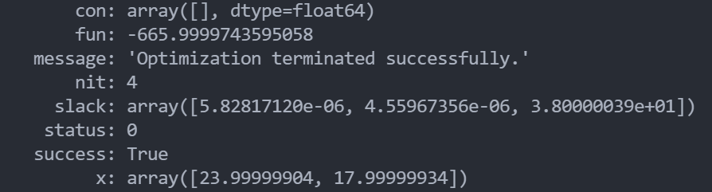

# 线性规划问题Python编程说明
题目如下：


题目还是比较基础的我们可以根据这个列出方程：
$$
\left\{
\begin{aligned}
&4x_1+3x_2\le150\\
&2x_1+4x_2\le120\\
&2x_1+3x_2\le140\\
&x_1\ge0\\
&x_2\ge0
\end{aligned}
\right.
$$
目标
$$
f_{max}(x_1,x_2)=15x_1+17x_2
$$
我们主要利用的是python中numpy模块的array和scipy中的optimize中的linprog进行求解。

这里代码中首先对array进行了说明，这不再赘述，然后我们将左边的不等式作为一个矩阵填入a_ub中，右边的答案填入b_ub中，**注意，这里一定要小心，我们要保证连接不等式的一定是小于号，所以如果是大于号连接，要乘上-1将符号反过来,求解也是求的最小值，所以我们如果要获得最大值，就要先将目标函数乘上-1求出最小值后，再乘上-1获得最大值，详情见下方代码：**
```python
from typing import AnyStr
from numpy.core.fromnumeric import reshape
from numpy.core.numeric import Inf
from scipy import optimize as op
import numpy as np
# 首先先介绍一下numpy.array模块
a=[[1,2,3],[4,5,6],[7,8,9]]
b=np.array(a)
a[2]=1
c=np.array(a)
print(a)
print(b)
print(c)
#然后下面进行线性规划
target=np.array([15,17])
a_ub=np.array([[4,3],[2,4],[2,3]])
b_ub=np.array([150,120,140])
x1=(0,Inf)
x2=(0,Inf)
ans=op.linprog(-target,a_ub,b_ub,bounds=(x1,x2))
print(ans)
```

结果如下：


我们只需要观察第二行fun的值和最后一行即可，fun代表了最后的最优化的值，x代表达到这个最小值的最终的变量的取值，最后只需要对fun乘上-1即可得到这道题最终的答案。